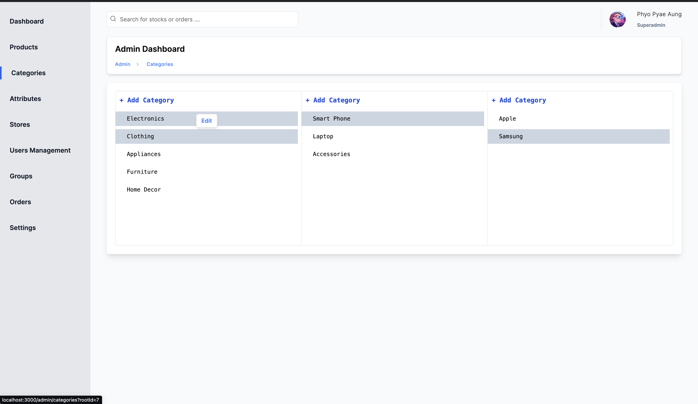
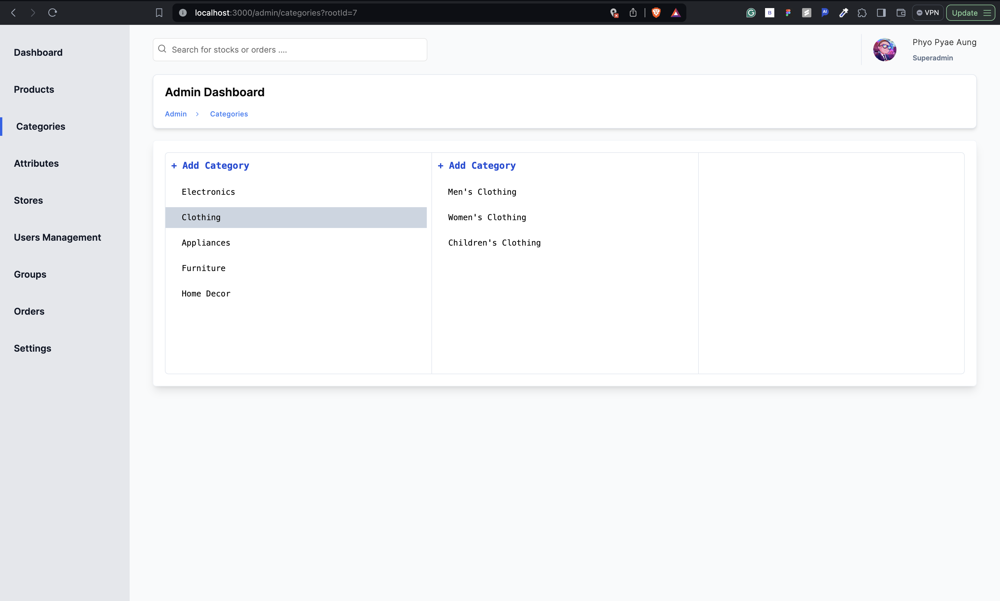
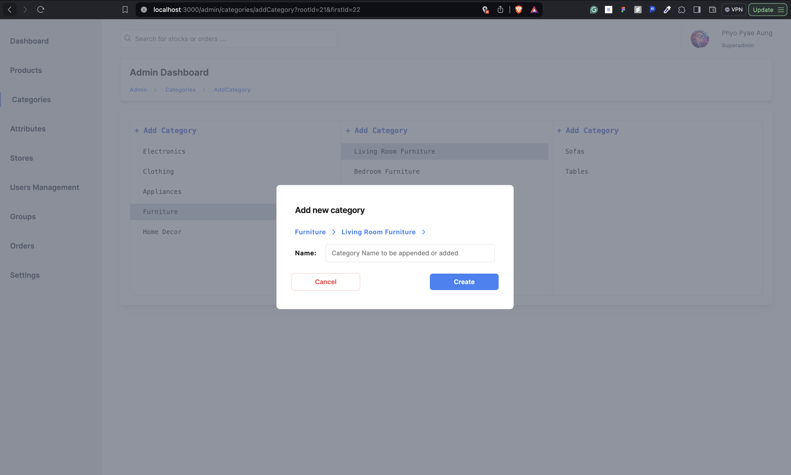
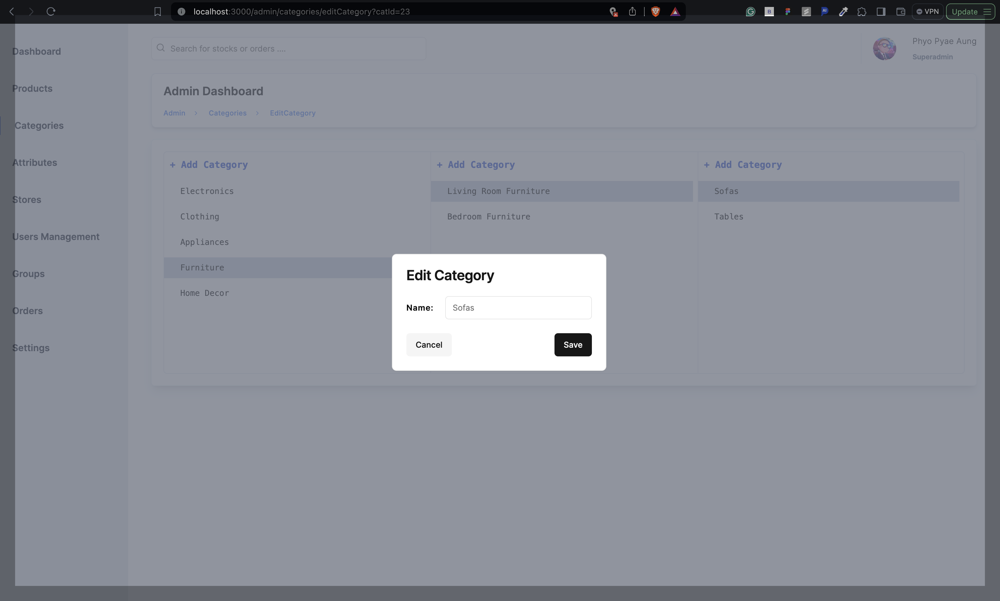

# Title: Simplifying Category Management in E-Commerce: A Comprehensive Guide to Nested Categories

## Introduction

Welcome to our comprehensive guide on nested categories in e-commerce! In this post, we'll delve deep into the implementation of nested categories in my personal project called, Mini-Ecommerce, an innovative platform that enhances user browsing experiences and streamlines administrative tasks. Whether you're a developer looking to optimize category management or seeking to improve your online store, this guide will provide you with valuable insights and practical implementation details.

## Why Nested Categories Matter

In the vast landscape of e-commerce, presenting products in a structured and organized manner is crucial for facilitating user navigation and enhancing the overall shopping experience. Traditional flat category structures often lead to cluttered interfaces and difficulties in finding specific products. Nested categories offer a solution by organizing products into a hierarchical structure, akin to the aisles and shelves in a physical store. By categorizing products into logical groups and subgroups, nested categories simplify the browsing process, guiding users to their desired items with ease.

## Understanding Nested Categories

My project leverages nested categories to optimize user experiences and streamline category management. Built on the Next.js framework and powered by Prisma ORM for data management, it offers a seamless and intuitive browsing experience for users while providing administrators with powerful tools for managing categories and products.

## The Challenge of Complexity

While nested categories offer clear benefits for user experience, managing an indefinite nesting structure can quickly become overwhelming for administrators. To address this challenge, I adopts a simplified approach by limiting nesting to three levels: main categories followed by two nested subcategories. This strategic decision strikes a balance between usability and manageability, ensuring that users can navigate through the category hierarchy effortlessly while simplifying administrative tasks for platform administrators.

## Solution Overview



### Database Structure

- **Prisma Self-Relationship:**
  - We utilize Prisma's self-relationship feature to establish a hierarchical structure for organizing categories.
  - Each category has an ID, a unique name, a list of associated products, and optional parent and children categories to establish the nesting hierarchy.
  - By leveraging Prisma's capabilities, we ensure efficient data management and retrieval, enabling seamless category organization and navigation.

### Administration Panel

- **Nested Categories Display:**
  - We divide the category display in the administration panel into three sections: parent categories, first-level subcategories, and second-level subcategories.
  - Each section includes buttons at the top to create new categories at that level, allowing administrators to easily manage the category hierarchy.
  - To create a new category nested under a specific parent category, the parent category must be selected, ensuring proper organization of categories.
  - By integrating server-side components and leveraging Next.js's server-side rendering capabilities, we achieve seamless interaction and category management without the need for client-side components.
  - We employ Next.js's server-side actions for category creation, enabling efficient and secure category management operations directly from the administration panel.

### User Application

- **Highlighting Selected Category:**
  - Instead of using useState hooks to manage the selected category state, we utilize Next.js's routing capabilities.
  - When a category is selected, the URL is updated with search parameters representing the selected category ID.
  - By linking to the same page with updated search parameters, we achieve dynamic highlighting of the selected category without relying on client-side state management.
  - This innovative approach enhances performance and simplifies code complexity, providing users with a seamless and intuitive category browsing experience.

## Implementation Details

Let's break down the implementation details!

### 1. Model Category Schema

```typescript
model Category {
  id       Int        @id @default(autoincrement())
  name     String     @unique @db.VarChar(255)
  products Product[]
  parentId Int?       @db.Integer
  parent   Category?  @relation("ParentChildren", fields: [parentId], references: [id])
  children Category[] @relation("ParentChildren")
}
```

**Explanation:**

- This Prisma model defines the structure of the `Category` entity in the database.
- Each category has an `id` (auto-incremented integer), a unique `name`, and an optional `parentId` to establish the nesting hierarchy.
- The `parent` and `children` fields establish a self-referencing relationship, allowing categories to be nested within each other.
- The `products` field represents a one-to-many relationship with the `Product` entity, indicating that each category can have multiple associated products.

**Approach Rationale:**

- This schema design facilitates the creation of nested categories by establishing parent-child relationships between categories.
- By limiting nesting to three levels and using optional parent references, the approach ensures manageability and simplifies category management.

### 2. Server Actions for Category Management

#### Add Category

```typescript
import { redirect } from "next/navigation";
import { isAdmin, isAuthenticted } from "../../../lib/session";
import { revalidatePath } from "next/cache";
import { getExtendedPrisma } from "../../../lib/extendedPrisma";

export async function addCategory(formData: any) {
  const isLogin: boolean = await isAuthenticted();
  const hasPermission: boolean = await isAdmin();

  if (!isLogin) redirect("/blahblah/...");

  if (!hasPermission) redirect("/blahblah/..");

  const prisma = await getExtendedPrisma();

  await prisma.category.create({
    data: formData,
  });

  revalidatePath("/admin/categories");
}
```

**Explanation:**

- The `addCategory` function handles the creation of new categories.
- It first checks if the user is authenticated (`isAuthenticted`) and has permission to add categories (`isAdmin`).
- If authentication or permission fails, the function redirects the user to the appropriate page with an error message.
- It utilizes Prisma ORM (`getExtendedPrisma`) to interact with the database and create a new category using the provided form data.
- After successful category creation, it triggers a cache revalidation to update the UI.

**Approach Rationale:**

- By enforcing authentication and permission checks, the approach ensures that only authorized users can add categories.
- Using Prisma ORM simplifies database interactions and enhances code readability.
- Triggering cache revalidation updates the UI in real-time, reflecting the newly added category without requiring a manual refresh.

#### Edit Category

```typescript
export async function editCategory(catId: number, newName: string) {
  const prisma = await getExtendedPrisma();

  await prisma.category.update({
    where: {
      id: catId,
    },
    data: {
      name: newName,
    },
  });
  revalidatePath("/admin/categories");
}
```

**Explanation:**

- The `editCategory` function updates the name of an existing category.
- It utilizes Prisma ORM to find the category by its ID (`catId`) and update its `name` with the new provided name (`newName`).
- After updating the category, it triggers a cache revalidation to refresh the UI.

**Approach Rationale:**

- Using Prisma ORM simplifies the process of updating category data in the database.
- Triggering cache revalidation ensures that the UI reflects the updated category name immediately after the edit operation.

### 3. Category Management Components

#### ModalForm Component

```jsx
"use client";

import { addCategory } from "@/app/actions/category";
import {
  Card,
  CardContent,
  CardFooter,
  CardHeader,
  CardTitle,
} from "@/components/ui/card";
import { Input } from "@/components/ui/input";
import { Label } from "@/components/ui/label";
import { useToast } from "@/components/ui/use-toast";
import { useRouter } from "next/navigation";
import { useForm } from "react-hook-form";

type FormValues = {
  name: string,
};

export default function ModalForm({
  parent,
  searchParams,
}: {
  parent: number | null,
  searchParams: any,
}) {
  // Component code
}
```

**Explanation:**

- The `ModalForm` component renders a modal form for adding new categories.
- It imports the `addCategory` action to handle category creation.
- Utilizes UI components like `Card`, `Input`, and `Label` for styling and input fields.
- Uses `useToast` hook for displaying success or error messages to the user.
- Relies on `useForm` hook from `react-hook-form` for form management and validation.

**Approach Rationale:**

- Breaking down the category management interface into modular components enhances code organization and maintainability.
- Utilizing UI components ensures consistent styling across the application.
- Leveraging hooks like `useToast` and `useForm` simplifies state management and user feedback handling.

#### CategoryTable Component

```jsx
"import Link from "next/link";
import { getCategories } from "@/app/utils/categories";
import {
  Tooltip,
  TooltipContent,
  TooltipProvider,
  TooltipTrigger,
} from "@/components/ui/tooltip";

export default async function CategoryTable({
  searchParams,
}: {
  searchParams: any;
}) {
  const categories = await getCategories();

  const selectedRoot = Number(searchParams.rootId) || null;
  const selectedFirst = Number(searchParams.firstId) || null;
  const selectedSecond = Number(searchParams.secondId) || null;

  const firstSubs =
    selectedRoot != null
      ? categories.filter((category) => category.parentId === selectedRoot)
      : [];

  const secondSubs =
    selectedFirst != null
      ? categories.filter((category) => category.parentId === selectedFirst)
      : [];

  const rootCategories = categories.filter(
    (category) => category.parentId === null,
  );

  return (
    <TooltipProvider>
      <div className=" grid grid-cols-3  bg-transparent">
        {/* Render parent categories */}
        <div className="flex h-96 flex-col gap-2 overflow-y-scroll rounded-l-md border border-r-0 border-slate-200">
          {/* Add new category button */}
          <Link
            href={`/admin/categories/addCategory`}
            className="cursor-pointer py-2 pl-2.5 pt-2.5 font-mono font-semibold text-blue-700 hover:bg-slate-300"
          >
            + Add Category
          </Link>
          {/* Render root categories */}
          {rootCategories.map((rc) => (
            // Tooltip for category name and edit link
            <Tooltip>
              <TooltipTrigger className="flex">
                <Link
                  key={rc.id}
                  href={`/admin/categories?rootId=${rc.id}`}
                  className={`w-full cursor-pointer py-2 pl-7 text-left font-mono text-sm hover:bg-slate-300
                ${rc.id == selectedRoot ? "bg-slate-300" : ""} `}
                >
                  {rc.name}
                </Link>
              </TooltipTrigger>
              <TooltipContent>
                {/* Edit link for root category */}
                <Link
                  className="text-sm font-semibold text-blue-500"
                  href={`/admin/categories/editCategory?catId=${rc.id}`}
                >
                  Edit
                </Link>
              </TooltipContent>
            </Tooltip>
          ))}
        </div>
        {/* Render first level subcategories */}
        <div className="flex h-96 flex-col gap-2 overflow-y-scroll border border-r-0 border-slate-200">
          {/* Render add new category button for first level subcategories */}
          {selectedRoot ? (
            <Link
              href={`/admin/categories/addCategory?rootId=${selectedRoot}`}
              className="cursor-pointer py-2 pl-2.5 pt-2.5 font-mono font-semibold text-blue-700 hover:bg-slate-300"
            >
              + Add Category
            </Link>
          ) : null}
          {/* Render first level subcategories */}
          {firstSubs.map((fc) => (
            // Tooltip for category name and edit link
            <Tooltip>
              <TooltipTrigger className="flex">
                <Link
                  key={fc.id}
                  href={`/admin/categories?rootId=${selectedRoot}&firstId=${fc.id}`}
                  className={`w-full cursor-pointer py-2 pl-7 text-left font-mono text-sm hover:bg-slate-300 ${
                    fc.id == selectedFirst && "bg-slate-300"
                  }`}
                >
                  {fc.name}
                </Link>
              </TooltipTrigger>
              <TooltipContent>
                {/* Edit link for first level subcategory */}
                <Link
                  className="text-sm font-semibold text-blue-500"
                  href={`/admin/categories/editCategory?catId=${fc.id}`}
                >
                  Edit
                </Link>
              </TooltipContent>
            </Tooltip>
          ))}
        </div>
        {/* Render second level subcategories */}
        <div className="flex h-96 flex-col gap-2 overflow-y-scroll rounded-r-md border border-slate-200 ">
          {/* Render add new category button for second level subcategories */}
          {selectedFirst ? (
            <Link
              href={`/admin/categories/addCategory?rootId=${selectedRoot}&firstId=${selectedFirst}`}
              className="cursor-pointer py-2 pl-2.5 pt-2.5 font-mono font-semibold text-blue-700 hover:bg-slate-300"
            >
              + Add Category
            </Link>
          ) : null}
          {/* Render second level subcategories */}
          {secondSubs.map((sc) => (
            // Tooltip for category name and edit link
            <Tooltip>
              <TooltipTrigger className="flex">
                <Link
                  key={sc.id}
                  href={`/admin/categories?rootId=${selectedRoot}&firstId=${selectedFirst}&secondId=${sc.id}`}
                  className={`w-full cursor-pointer py-2 pl-7 text-left font-mono text-sm hover:bg-slate-300 ${
                    sc.id == selectedSecond ? "bg-slate-300" : ""
                  }`}
                >
                  {sc.name}
                </Link>
              </TooltipTrigger>
              <TooltipContent>
                {/* Edit link for second level subcategory */}
                <Link
                  className="text-sm font-semibold text-blue-500"
                  href={`/admin/categories/editCategory?catId=${sc.id}`}
                >
                  Edit
                </Link>
              </TooltipContent>
            </Tooltip>
          ))}
        </div>
      </div>
    </TooltipProvider>
  );
}
```

Let's break down the main functions in the `CategoryTable` component!

1. **Fetching Categories:**

```typescript
const categories = await getCategories();
```

This line fetches the list of categories from the backend using the `getCategories` function. It awaits the result of the asynchronous operation to ensure that the categories are retrieved before proceeding.

2. **Parsing Search Parameters:**

```typescript
const selectedRoot = Number(searchParams.rootId) || null;
const selectedFirst = Number(searchParams.firstId) || null;
const selectedSecond = Number(searchParams.secondId) || null;
```

These lines parse the search parameters passed to the component. They convert the parameters to numbers using `Number()` and assign them to variables `selectedRoot`, `selectedFirst`, and `selectedSecond`. If the parameters are not provided or invalid, they default to `null`.

3. **Filtering Categories:**

```typescript
const firstSubs =
  selectedRoot != null
    ? categories.filter((category) => category.parentId === selectedRoot)
    : [];
```

This code filters the categories to display first-level subcategories based on the `selectedRoot` parameter. If `selectedRoot` is not `null`, it filters categories with a `parentId` matching `selectedRoot`. Otherwise, it initializes an empty array.

Similarly, `secondSubs` filters second-level subcategories based on the `selectedFirst` parameter.

```typescript
const rootCategories = categories.filter(
  (category) => category.parentId === null
);
```

This line filters the root categories, which have a `parentId` of `null`, to display them separately in the first column of the table.



4. **Rendering Categories:**

The component uses conditional rendering and maps over the filtered categories to render them in the appropriate columns of the table. It dynamically generates links for each category, allowing users to navigate to specific levels of the nested hierarchy.

5. **Adding New Categories:**

```typescript
<Link
  href={`/admin/categories/addCategory`}
  className="cursor-pointer py-2 pl-2.5 pt-2.5 font-mono font-semibold text-blue-700 hover:bg-slate-300">
  + Add Category
</Link>
```



This code renders a link to the "Add Category" page, allowing users to create new categories. The link is conditionally rendered based on the selected level of the hierarchy to ensure that users can only add categories at appropriate levels.

1. **Editing Categories:**

```typescript
<Link
  className="text-sm font-semibold text-blue-500"
  href={`/admin/categories/editCategory?catId=${categoryId}`}>
  Edit
</Link>
```



This code renders a link to the "Edit Category" page for each category, allowing users to edit existing categories. The link includes the category ID as a query parameter to specify the category to be edited.

Overall, the `CategoryTable` component dynamically renders categories based on search parameters, providing users with a hierarchical view of the category structure and enabling them to manage categories effectively.

**Approach Rationale:**

- Separating category creation and editing functionalities into distinct components improves code readability and maintainability.
- Reusing UI components ensures consistent styling and user experience across different parts of the application.
- Leveraging hooks for state management and input field access simplifies component logic and enhances reusability.

## Results and Analysis

The implementation of nested categories in my project has resulted in a more structured and organized browsing experience for users. By limiting nesting to three levels, the platform strikes a balance between usability and manageability, ensuring ease of navigation for users while simplifying administrative tasks for administrators.

## Conclusion

Nested categories play a crucial role in enhancing user experiences and streamlining administrative tasks in e-commerce platforms . By adopting a simplified nesting structure and leveraging cutting-edge technologies, my project is able to offer users a seamless and intuitive shopping experience while empowering administrators to efficiently manage categories.

---

**About the Author:** Phyo Pyae & Htet Aung - Full-stack Developers passionate about creating user-centric e-commerce solutions.

**Contact:** <phyopyaemaung1@gmail.com> or <htetaung251220@gmail.com>

**Tags:** E-commerce, Nested Categories, Category Management, Next.js, Prisma ORM.

**Date:** February 28, 2024
